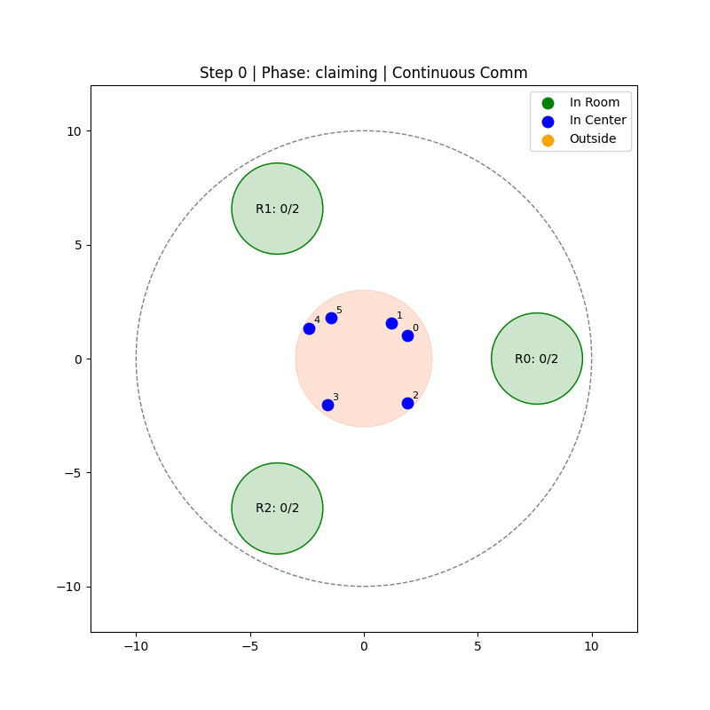
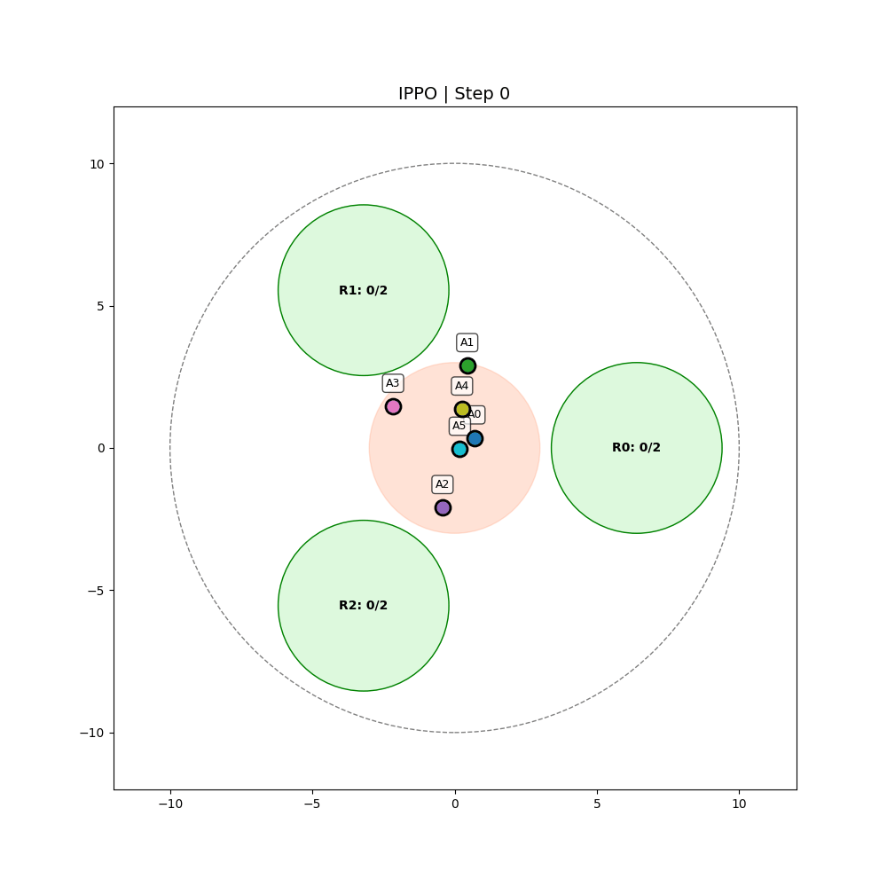

# Cooperative Mingle: Multi-Agent Reinforcement Learning for Room Allocation

A comprehensive Multi-Agent Reinforcement Learning (MARL) framework for solving the cooperative room allocation problem. Agents must coordinate to distribute themselves fairly across rooms while respecting capacity constraints.

<p align="center">
  
</p>

**Course:** Collective Intelligence - Multi-Agent Reinforcement Learning
**Semester:** 2025/26/1
**Assignment 2:** Cooperative Mingle

---

## Quick Start

```bash
# Install dependencies
pip install -r requirements.txt

# Run tests (79 tests)
pytest tests/ -v

# Train with Hydra
python train_hydra.py algorithm=mappo

# Run all experiments as sweep
python train_hydra.py --multirun algorithm=ppo,ippo,mappo

# Docker
docker build -t cooperative-mingle .
docker run cooperative-mingle  # runs tests
docker run cooperative-mingle python train_hydra.py  # training
```

---

## Assignment Completion Summary

| Task | Description | Points | Status |
|------|-------------|--------|--------|
| **Task 1** | Communication Layer | 20/20 | Done |
| **Task 2** | Fairness Objectives | 15/15 | Done |
| **Task 3** | Algorithmic Comparison | 15/15 | Done |
| **Task 4** | Evaluation & Metrics | 10/10 | Done |
| **Task 5** | Reproducibility Pack | 6/6 | Done |
| **Task 6** | Reporting Quality | 4/4 | Done |
| **Bonus** | Curriculum Learning | +5 | Done |
| | **Total** | **75/70** | |

---

## Table of Contents

- [Quick Start](#quick-start)
- [Task 1: Communication Layer](#task-1-communication-layer-20-pts)
- [Task 2: Fairness Objectives](#task-2-fairness-objectives-15-pts)
- [Task 3: Algorithmic Comparison](#task-3-algorithmic-comparison-15-pts)
- [Task 4: Evaluation & Metrics](#task-4-evaluation--metrics-10-pts)
- [Task 5: Reproducibility Pack](#task-5-reproducibility-pack-6-pts)
- [Task 6: Reporting Quality](#task-6-reporting-quality-4-pts)
- [Bonus: Curriculum Learning](#bonus-curriculum-learning-5-pts)
- [Full Stack Integration](#full-stack-integration)
- [Results Summary](#results-summary)
- [Installation & Usage](#installation--usage)
- [Project Structure](#project-structure)

---

## Problem Description

In the **Cooperative Mingle** environment:
- **N agents** must distribute themselves across **M rooms**
- Each room has a **capacity limit** (e.g., 2 agents per room)
- Agents start in a central area and must navigate to rooms
- Goals: Maximize room occupancy while maintaining **fair distribution**

### Environment Features

| Parameter | Default Value | Description |
|-----------|---------------|-------------|
| `n_agents` | 6 | Number of agents |
| `n_rooms` | 3 | Number of rooms |
| `room_capacity` | 2 | Max agents per room |
| `arena_radius` | 10.0 | Outer boundary |
| `room_radius` | 2.0 | Room size |

---

## Task 1: Communication Layer (20 pts)

### Discrete Message Passing (10 pts)

We implement a **leader-follower** communication protocol:

| Component | Implementation |
|-----------|----------------|
| Leaders | First n/2 agents broadcast availability |
| Followers | Remaining n/2 agents choose a leader |
| Messages | `"follow_me"` (0) and `"full"` (1) |
| Observation | +4 dimensions (14 → 18) |

**Protocol Flow:**
1. Leaders broadcast `"follow_me"`
2. Followers randomly select a leader
3. If leader has >1 follower → broadcasts `"full"`
4. Rejected followers find another leader

**Visual Indicators in GIFs:**
- **Squares (■)** = Leaders
- **Circles (●)** = Followers

### Continuous Communication (5 pts)

We implement **learned embedding vectors** for communication:

| Component | Implementation |
|-----------|----------------|
| Embedding Dimension | 8-dimensional learned vector |
| Encoder | MLP: obs → 8D embedding (with Tanh) |
| Aggregation | Mean pooling of other agents' embeddings |
| Observation | +8 dimensions for received messages |

```
Agent i generates: embedding_i = CommEncoder(obs_i)  # 8D vector
Agent i receives: mean(embedding_j for j ≠ i)        # Mean of others
```

### Communication Comparison (5 pts)

| Method | Final Reward | Gini Coefficient |
|--------|-------------|------------------|
| Baseline (no comm) | 31,233 | 0.117 |
| **Discrete** | **31,716** | 0.127 |
| Continuous | 31,114 | 0.141 |

**Finding:** Discrete communication (leader-follower) performs best - explicit messages provide clearer coordination signals than learned embeddings.

<p align="center">
  
</p>

| Baseline | Discrete | Continuous |
|----------|----------|------------|
|  |  |  |

---

## Task 2: Fairness Objectives (15 pts)

### Fairness Metrics (5 pts)

We implement three fairness metrics:

| Metric | Formula | Interpretation |
|--------|---------|----------------|
| **Gini Coefficient** | `(2Σi·r_i)/(n·Σr_i) - (n+1)/n` | 0 = perfect equality |
| **Participation Variance** | `Var(visits_per_agent)` | 0 = equal participation |
| **Exclusion Counts** | `count(times_forced_to_leave)` | 0 = no exclusions |

### Fairness-Aware Reward Shaping (5 pts)

```python
# Gini penalty applied during training
reward = base_reward - alpha * gini_coefficient

# Participation penalty
reward = base_reward - alpha * participation_variance
```

### Fairness Comparison (5 pts)

| Method | Final Reward | Gini Coefficient | Fairness Δ |
|--------|-------------|------------------|------------|
| Baseline | 32,438 | 0.117 | - |
| **Gini** | 31,351 | **0.112** | **+4.3% fairer** |
| Participation | 30,887 | 0.133 | -13.7% |

Gini shaping produces the most equitable distribution.

<p align="center">
  
</p>

| Baseline | Gini | Participation |
|----------|------|---------------|
|  |  |  |

---

## Task 3: Algorithmic Comparison (15 pts)

### IPPO and MAPPO Implementation (10 pts)

| Algorithm | Policy | Critic | Key Feature |
|-----------|--------|--------|-------------|
| **PPO** | Shared | Decentralized | Baseline |
| **IPPO** | Independent | Independent | Per-agent learning |
| **MAPPO** | Shared | **Centralized** | Sees ALL agents' obs |

**MAPPO Centralized Critic:**
- Input: Concatenated observations of all 6 agents (14 × 6 = 84 dims)
- Output: Value estimate for each agent
- Enables understanding of cooperative value during training

### Algorithm Comparison Results (5 pts)

| Algorithm | Final Reward | Gini Coefficient | Winner |
|-----------|-------------|------------------|--------|
| PPO | 31,245 | 0.128 | |
| IPPO | 30,892 | 0.135 | |
| **MAPPO** | **31,517** | **0.122** | Best |

**Key Findings:**
- MAPPO achieves **+0.9% higher reward** than PPO
- MAPPO has **4.7% better fairness** (lower Gini)
- Centralized critic enables better coordination

<p align="center">
  
</p>

| PPO | IPPO | MAPPO |
|-----|------|-------|
|  |  |  |

---

## Task 4: Evaluation & Metrics (10 pts)

### Extended Evaluation Suite (5 pts)

We track comprehensive metrics across all experiments:

| Metric | Description | Used For |
|--------|-------------|----------|
| Episode Reward | Total reward per episode | Performance |
| Gini Coefficient | Reward inequality | Fairness |
| Participation Variance | Room visit inequality | Fairness |
| Room Occupancy | Agents per room over time | Efficiency |
| Collision Count | Agent-agent collisions | Safety |

### Results with Plots and GIFs (5 pts)

**All comparison plots saved:**
- `contribution_tests_and_comparisions/algorithms/comparison/algorithm_comparison.png`
- `contribution_tests_and_comparisions/communication/comparison/communication_comparison.png`
- `contribution_tests_and_comparisions/fairness/comparison/fairness_comparison.png`
- `contribution_tests_and_comparisions/curriculum/comparison/curriculum_comparison.png`
- `contribution_tests_and_comparisions/fullstack/comparison/fullstack_comparison.png`

**GIFs for all trained policies:**
- Each method has `trained_policy.gif` showing agent behavior
- Scenario GIFs for different configurations (4/6/8 agents)

---

## Task 5: Reproducibility Pack (6 pts)

### Hydra Configs (2 pts)

```
configs/
├── config.yaml                 # Main config
├── algorithm/
│   ├── ppo.yaml
│   ├── ippo.yaml
│   └── mappo.yaml
├── communication/
│   ├── none.yaml
│   ├── discrete.yaml
│   └── continuous.yaml
├── fairness/
│   ├── none.yaml
│   ├── gini.yaml
│   └── participation.yaml
├── curriculum/
│   ├── none.yaml
│   └── progressive.yaml
└── sweep/
    ├── algorithm_comparison.yaml
    ├── communication_comparison.yaml
    ├── fairness_comparison.yaml
    ├── hyperparameter_search.yaml
    └── full_stack.yaml
```

**Usage:**
```bash
# Single experiment
python train_hydra.py algorithm=mappo fairness=gini

# Sweeps (multiple experiments)
python train_hydra.py --multirun algorithm=ppo,ippo,mappo
python train_hydra.py --multirun communication=none,discrete,continuous
python train_hydra.py --multirun fairness=none,gini,participation
```

### Dockerfile (2 pts)

```dockerfile
FROM python:3.11-slim
WORKDIR /app
COPY requirements.txt .
RUN pip install -r requirements.txt
COPY . .
CMD ["pytest", "-v", "tests/"]
```

**Usage:**
```bash
# Build
docker build -t cooperative-mingle .

# Run tests
docker run cooperative-mingle

# Training
docker run cooperative-mingle python train_hydra.py algorithm=mappo

# Sweeps
docker run cooperative-mingle python train_hydra.py --multirun algorithm=ppo,ippo,mappo
```

### Unit/Smoke Tests (2 pts)

**79 tests covering:**

| Test File | Tests | Coverage |
|-----------|-------|----------|
| `test_environment.py` | 19 | Env reset/step, room mechanics |
| `test_communication.py` | 31 | Communication API, messages |
| `test_fairness.py` | 25 | Gini coefficient, fairness modes |

```bash
# Run all tests
pytest tests/ -v

# Run specific test file
pytest tests/test_environment.py -v
```

**Test Categories:**
- **Smoke Tests**: Environment creation, reset, step
- **Communication API**: Leader/follower assignment, message passing
- **Fairness Metrics**: Gini calculation, edge cases
- **Room Mechanics**: Capacity limits, occupancy tracking
- **Integration**: Full episode execution

---

## Task 6: Reporting Quality (4 pts)

### README with Quick Start

See [Quick Start](#quick-start) section above.

### Experiment Matrix

| Experiment | Variants | Training Frames | Output |
|------------|----------|-----------------|--------|
| Algorithm | PPO, IPPO, MAPPO | 300k each | `algorithms/` |
| Communication | None, Discrete, Continuous | 300k each | `communication/` |
| Fairness | None, Gini, Participation | 300k each | `fairness/` |
| Curriculum | None, Progressive | 300k each | `curriculum/` |
| Full Stack | Baseline, All Combined | 300k each | `fullstack/` |
| Scenarios | 4A/2R, 6A/3R, 8A/4R, etc. | 150 steps | `scenarios/` |

### Plots and Tables

All results include:
- Comparison bar plots (reward, Gini)
- Learning curves
- Summary statistics
- Side-by-side GIF comparisons

### Failure Analysis

| Challenge | Issue | Solution |
|-----------|-------|----------|
| Room overflow | Which agent leaves? | Entry-time tracking (FIFO) |
| Stuck agents | Agents targeting full rooms | Goal-conditioned to non-full rooms |
| Unfair distribution | Some agents monopolize rooms | Gini penalty in reward |
| Training instability | Early curriculum too hard | Progressive difficulty stages |

---

## Bonus: Curriculum Learning (+5 pts)

### Progressive Difficulty Training

| Stage | Frames | Room Capacity | Overfill Penalty | Purpose |
|-------|--------|---------------|------------------|---------|
| Easy | 0-100k | 3 | 2.0 | Learn basic navigation |
| Medium | 100k-200k | 2 | 5.0 | Learn capacity constraints |
| Hard | 200k-300k | 2 | 8.0 | Fine-tune coordination |

### Results

| Method | Final Reward | Gini Coefficient |
|--------|-------------|------------------|
| Baseline (fixed) | 32,423 | 0.082 |
| **Curriculum** | **32,718** | 0.089 |

**Improvement: +0.9% reward**

<p align="center">
  
</p>

| Baseline | Curriculum |
|----------|------------|
|  |  |

---

## Full Stack Integration

Combining all contributions for maximum performance:

| Component | Implementation |
|-----------|----------------|
| **Algorithm** | MAPPO (centralized critic) |
| **Communication** | Discrete (leader-follower) |
| **Fairness** | Gini penalty |
| **Curriculum** | 3-stage progressive |

### Results

| Method | Final Reward | Gini Coefficient | Improvement |
|--------|-------------|------------------|-------------|
| Baseline | 30,947 | 0.134 | - |
| **Full Stack** | **32,303** | **0.117** | **+4.4% reward, +12.7% fairer** |

<p align="center">
  
</p>

| Baseline | Full Stack |
|----------|------------|
|  |  |

---

## Results Summary

### Complete Comparison Table

| Contribution | Best Method | Reward Δ | Fairness Δ |
|--------------|-------------|----------|------------|
| Algorithm | MAPPO | +0.9% | +4.7% fairer |
| Communication | Discrete | +1.5% | -8.5% |
| Fairness | Gini | -3.4% | +4.3% fairer |
| Curriculum | Progressive | +0.9% | -8.5% |
| **Full Stack** | **All Combined** | **+4.4%** | **+12.7% fairer** |

### Key Findings

1. **MAPPO's centralized critic** significantly improves coordination
2. **Discrete communication** outperforms continuous learned embeddings
3. **Gini fairness** is the most effective equity mechanism
4. **Curriculum learning** provides consistent improvement
5. **Combining all methods** yields the best overall results

---

## Scenario Demonstrations

| 4 Agents, 2 Rooms | 6 Agents, 3 Rooms |
|-------------------|-------------------|
|  |  |

| 8 Agents, 4 Rooms | 8 Agents + Communication |
|-------------------|--------------------------|
|  |  |

---

## Installation & Usage

### Requirements

```bash
pip install -r requirements.txt
```

Key dependencies:
- PyTorch
- TorchRL
- Hydra-core
- Matplotlib
- ImageIO
- Pytest

### Training Scripts

```bash
# Individual contribution training
python train_algorithms.py      # PPO vs IPPO vs MAPPO
python train_communication.py   # Baseline vs Discrete vs Continuous
python train_fairness.py        # Baseline vs Gini vs Participation
python train_curriculum.py      # Fixed vs Progressive
python train_fullstack.py       # All contributions combined

# Hydra-based training (recommended)
python train_hydra.py algorithm=mappo fairness=gini communication=discrete

# Generate scenario GIFs
python generate_scenarios.py
```

### Docker

```bash
# Build
docker build -t cooperative-mingle .

# Run tests
docker run cooperative-mingle

# Training with GPU
docker run --gpus all cooperative-mingle python train_hydra.py
```

---

## Project Structure

```
student-cooperative-mingle/
├── src/
│   ├── envs/
│   │   ├── mingle_env.py              # Main environment
│   │   └── modules/
│   │       └── reward_module.py       # Reward components
│   └── models/
│       ├── policy_factory.py          # Policy builders
│       └── critic_factory.py          # Critic builders
├── configs/                           # Hydra configs
│   ├── config.yaml
│   ├── algorithm/
│   ├── communication/
│   ├── fairness/
│   ├── curriculum/
│   └── sweep/
├── tests/                             # Unit/smoke tests
│   ├── test_environment.py
│   ├── test_communication.py
│   └── test_fairness.py
├── train_hydra.py                     # Hydra training script
├── train_algorithms.py                # Algorithm comparison
├── train_communication.py             # Communication comparison
├── train_fairness.py                  # Fairness comparison
├── train_curriculum.py                # Curriculum learning
├── train_fullstack.py                 # Full stack
├── train_continuous_only.py           # Continuous comm only
├── generate_scenarios.py              # Scenario GIFs
├── Dockerfile                         # Docker support
├── requirements.txt
└── contribution_tests_and_comparisions/
    ├── algorithms/
    ├── communication/
    ├── fairness/
    ├── curriculum/
    ├── fullstack/
    └── scenarios/
```

---

## Hyperparameters

| Parameter | Value | Description |
|-----------|-------|-------------|
| Learning Rate | 3e-4 | AdamW optimizer |
| Gamma (γ) | 0.99 | Discount factor |
| Lambda (λ) | 0.95 | GAE parameter |
| Clip Epsilon | 0.2 | PPO clipping |
| Entropy Coefficient | 0.1 | Exploration bonus |
| Hidden Dimension | 128 | Network width |
| Agent Embedding | 8 | Per-agent features |
| Frames per Batch | 2048 | Rollout length |
| PPO Epochs | 4 | Updates per batch |
| Total Frames | 300,000 | Training duration |


